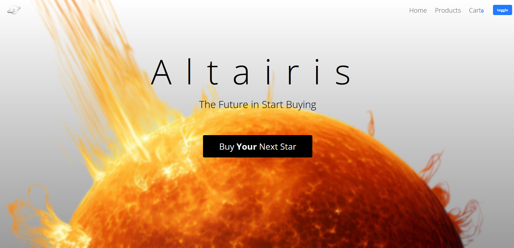
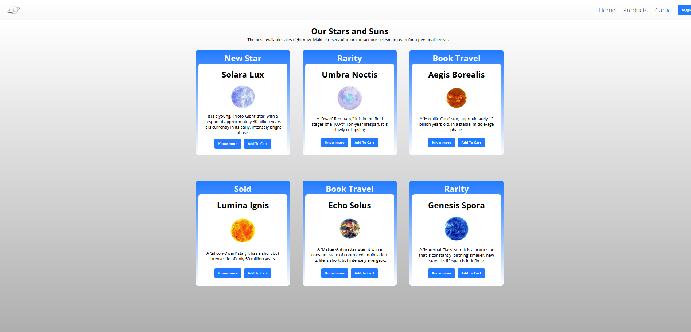
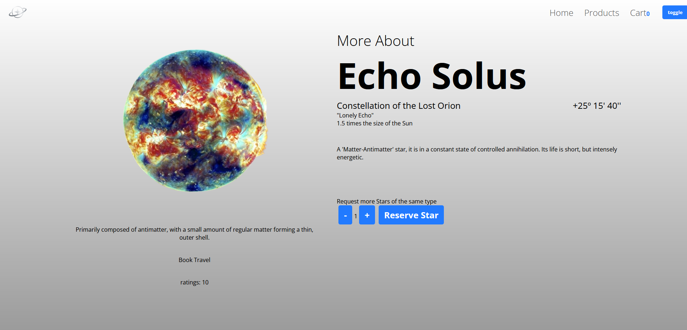
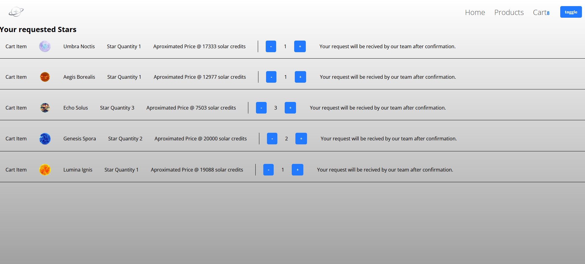
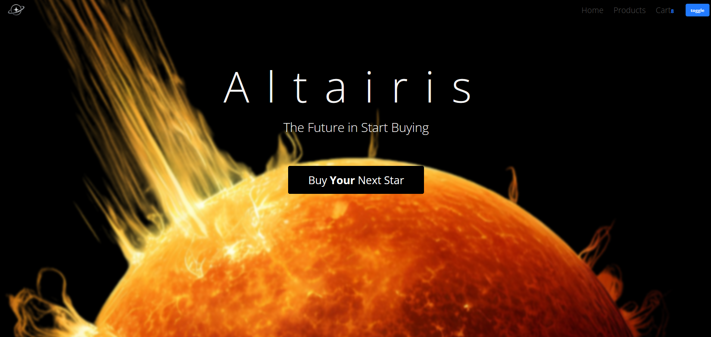
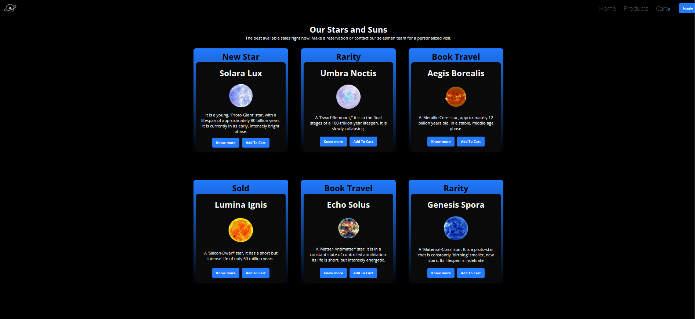

# Estilização de um E-commerce.📘

Este projeto foi realizado para o curso de dev fullStack da +praTI. 📝 Com o objetivo de melhorar tecnicas de estilização e ReactJS.

### 🌟 Altairis - uma página de compras de Estrelas.🌟

A ideia surgiu pelo gosto de temas como: espaço, estrelas, planetas. Assim Altairis, é um e-commerce on você pode comprar estrelas para a produção de energia. 

- Porque "Altairis"? Altair é a estrela que mais brilha no céu. E ela carrega o significado em seu nome de "aquele que voa".  
- Preços não são o foco, pois ficam sob consulta, mas você pode ter uma ideia de valores quando for ver seu carrinho. 

- Para acessar a aplicação inicialize em sua máquina.

### Utilizando css-globas | css-modules | css-Styled-components | Tailwind ✏

1. Css-globals. 
   Onde o código css fica com acesso global no projeto, ou seja, qualquer tag em um componente pode acessar a classe ou id de estilo. 
2. Css-Modules. 
   Onde o código fica modular para apenas um componente, utilizando da nomenclatura 'nome.module.css' as classes contidas ficam disponiveis apenas por importação. 
   Além de seguir uma boa pratica de manter o componente e seu .css juntos dentro de uma pasta, ex. /componentes/navBar/NavBar.jsx + navbar.module.css. 

3. Styled-Components. 
   Utilizando da bliblioteca com o mesmo nome, ela possibilita a criação de componentes de estilos dentro do arquivo .jsx. 
   Seguindo a nomenclatura: NomeTag = styled.div`estilos` onde "styled. " é seguido pela tag que deseja criar (div/p/span/header/h1...)
   Para seu uso deve-se substituir as tags originais pela criada -> "`

 para <NomeTag></NomeTag>`" . assim aplicando os estilos. 
4. Tailwind. 
   Utilizando do framework de mesmo nome, este possibilita utilizar classes já criadas, assim optimizando o código. 
   Basta apenas seguir a documentação para usar a nomenclatura correta, ex. className="font-bold text-white" , irá tornar a font 700 e com cor branca. 
   Para utilizar cores e media querys especificas deve-se configurar o arquivo tailwind.config.js com as opções 'screens e colors'

### Funcionalidades Obrigatórias

1. Breakpoints exatamente como descritos.✅ _(o Layout do grid de produtos se adapta conforme)_
2. Dark mode com persistência.✅ _(utilizando o localStorage para a persistência)_
3. Focus ring visível.✅ _(Botões)_
4. Skeleton sem layout shift.✅ _(Como a página carrega elementos locais a página foi configurada para centralizar as tags, assim não ocorrem shifts na página/ pode ser melhorado por meio de um componente LazyLoading)_
5. Variantes do botão consistentes nos dois temas.✅ _(Os botões permaneceram com a mesma cor, porém background e text colors são modificados)_
6. Organização clara de pastas e uso de tokens (cores, espaçamentos, raio, sombras).✅ _(components e pages estão em respectivas páginas, além de contex, data e stores)_

## Estrutura do Projeto 📎

Cada pasta contém um projeto unico, este que contém cada técnica de estilização. 
Dentro de cada projeto contém as pastas:

- components - Onde os compoentes estão localizados.
- pages - páginas da aplicação.
- data - arquivos .json e .js para consumo dos "produtos".
- context - contexto global do "theme".
- assets - imagens.
- stores - arquivos que fazem o tratamento do carrinho.
- Arquivo App.jsx e main.jsx que fazem o router entre as páginas e a renderização do NavBar e Outlet.

- Dentro do Projeto "E-commerceBase" você irá encontrar o projeto base sem estilização, apenas suas funcionalidades.

Por que não está dentro de um unico projeto? 
No momento de dar build estava quebrando. Por isso apenas o build do css-globals estará disponivél :( 

## Como rodar em sua máquina 🖥

1. Tenha um editor de texto como o VSCode ou IDE instalada.
2. Realize um fork/clone ou baixe os aquivos em sua máquina.
3. Dentro da pasta de cada projeto baixe as dependencias do node pelo comando: 
   `npm i` ou `npm install` 
4. Ainda dentro da pasta do projeto inicialize pelo comando: 
   `npm run dev` 
5. Siga para o caminho/porta de localhost que o vite inicializou com seu navegador de escolha.
6. Você estará vendo o projeto :D

## Desafios e Tecnologias 🛠

- Vite - Para sua inicialização.
- ReactJS - Para sua estrutura.
- Tailwind, css, styled-componets
- Uso de Fetch para simular uma API, por meio dos arquivos Data.json e products.js
- Uso de Persistência do tema pelo localhost
- Uso da opção de "carrinho", onde mais quantias de produtos podem ser adicionadas e seu preço calculado.

## Bugs conhecidos 👀

Mudar o height da página para algo diferente de height:100vh está quebrando a página home, porém se não mudado a página products não fica com o gradiente completo por conta de um transbordamento do grid.

## Funcionalidades Futuras ?🔔

- Ao mudar o tema ocorrer a mudança de estrelas para planetas, ou seja os arquivos de produtos serão mudados e não apenas o tema.
- Adicionar filtros por categorias de produtos.
- Adicionar leves animações nas cards e em imagens de planetas para imitar a rotação dos mesmos.

## Prints das Páginas 📸

Página Principal - Home (Light mode)

Página Produtos - Products (Light mode)

Página Sobre o Produto - About (Light mode)

Página Carrinho - Cart (Light mode)

Página Principal - Home (Dark mode)

Página Produtos - Products (Dark mode)

